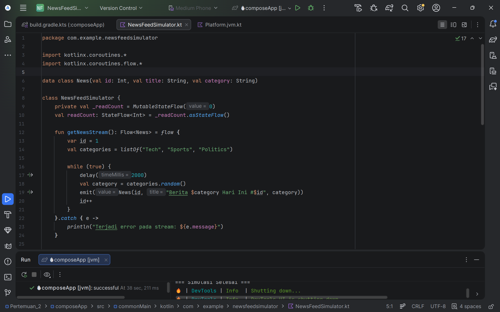
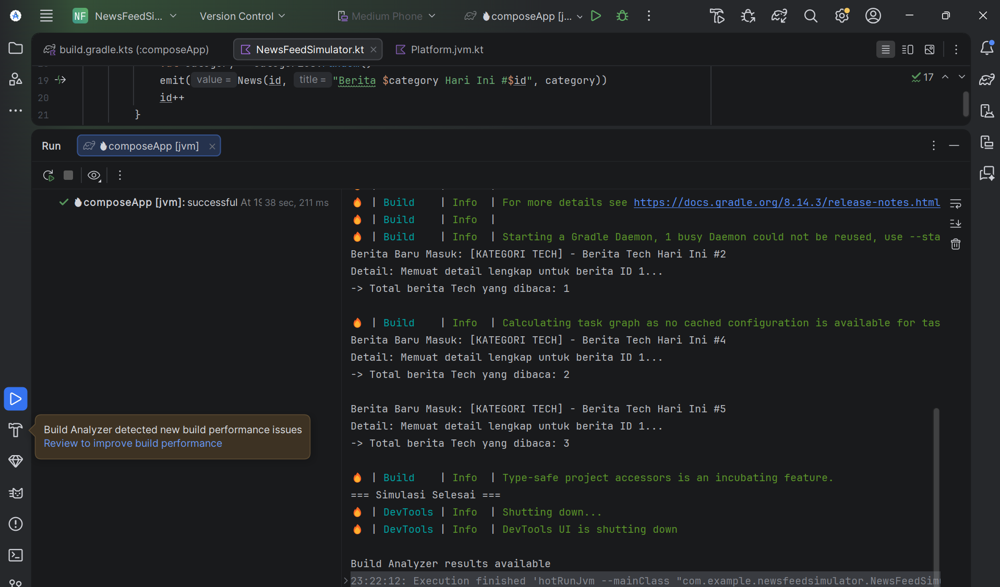

# Tugas Praktikum PAM - Pertemuan 2: News Feed Simulator

**Identitas Mahasiswa:**
- **Nama:** Ragil Bayu Saputra
- **NIM:** 123140128

---

## Deskripsi Tugas
Aplikasi console sederhana berbasis Kotlin Multiplatform untuk mensimulasikan aliran data berita menggunakan **Coroutines** dan **Flow**.

Aplikasi ini memenuhi 5 kriteria utama tugas:
1. **Flow**: Mensimulasikan data berita baru masuk setiap 2 detik.
2. **Filter**: Memfilter berita yang masuk hanya untuk kategori "Tech".
3. **Transform**: Mengubah data (*mapping*) menjadi format string yang rapi untuk ditampilkan.
4. **StateFlow**: Menyimpan dan mengupdate state jumlah berita yang sudah dibaca.
5. **Coroutines**: Menggunakan *suspend function* untuk mensimulasikan pengambilan detail berita secara *asynchronous* tanpa memblokir sistem.

## Cara Menjalankan
1. Buka project ini di Android Studio.
2. Buka susunan folder: `composeApp/src/commonMain/kotlin/com/example/newsfeedsimulator/NewsFeedSimulator.kt`
3. Scroll ke bagian paling bawah pada fungsi `main()`.
4. Klik ikon **Play (hijau)** di sebelah kiri `fun main() = runBlocking { ... }`.
5. Pilih **Run 'composeApp [jvm]'**. Output simulasi akan muncul di jendela Run/Terminal bagian bawah.

---

## Screenshot Hasil Pengerjaan

### 1. Bukti Penulisan Kode

### 2. Bukti Output Program Berhasil Berjalan
