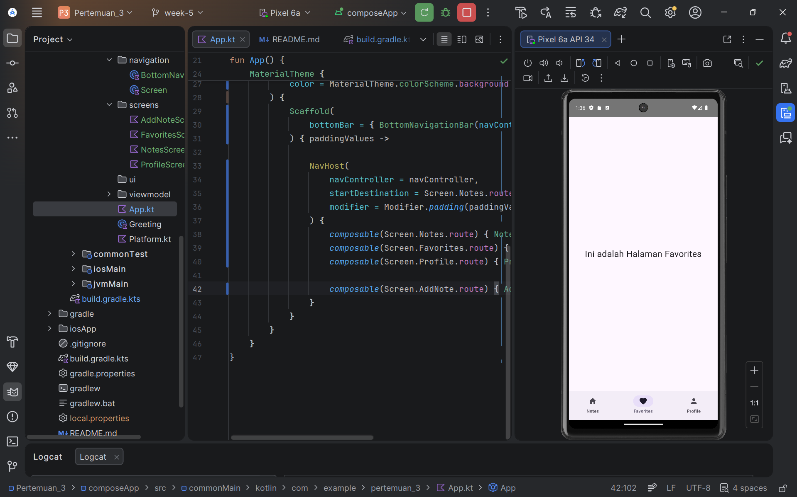
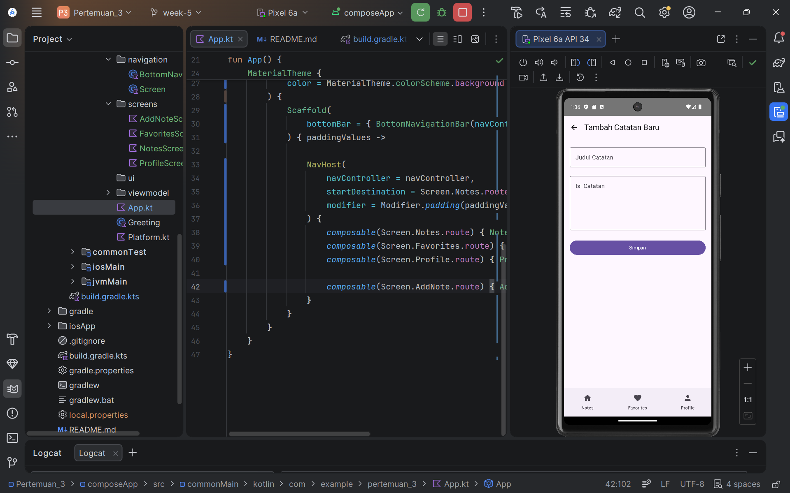

# Proyek Pengembangan Aplikasi Mobile - Pertemuan 3, 4, & 5

Repositori ini berisi progres tugas mata kuliah Pemrograman Aplikasi Mobile (PAM). Untuk efisiensi struktur proyek, seluruh materi dan implementasi dari **Pertemuan 3, 4, dan 5** dikonsolidasikan dan dikembangkan di dalam satu folder utama, yaitu folder `pertemuan_3`.

## 📂 Struktur Proyek & Cakupan Materi

Meskipun berada di dalam folder `pertemuan_3`, proyek ini mencakup integrasi materi dari tiga pertemuan sekaligus:

* **Pertemuan 3:** Inisialisasi proyek Kotlin Multiplatform (KMP) dan dasar-dasar UI dengan Jetpack Compose.
* **Pertemuan 4:** Pengembangan komponen UI yang lebih kompleks, termasuk implementasi Profile Screen, Toggle Dark Mode, dan State Management dasar.
* **Pertemuan 5:** Implementasi sistem navigasi antar layar (Routing) menggunakan Compose Navigation, pembuatan Bottom Navigation Bar, dan integrasi antar halaman (Notes, Favorites, Profile, serta Add Note).

## 🚀 Fitur Utama Saat Ini

* **Navigasi Terpadu:** Menggunakan `NavHost` untuk mengelola perpindahan antar layar secara *seamless*.
* **Bottom Navigation Bar:** Menu akses cepat untuk halaman utama.
* **Formulir Input Catatan:** Layar tambah catatan yang dilengkapi dengan kontrol navigasi kembali (pop backstack).
* **Profile Management:** Tampilan profil mahasiswa Teknik Informatika yang interaktif dengan fitur Dark Mode.

## 🛠️ Teknologi yang Digunakan

* **Kotlin Multiplatform (KMP)**
* **Jetpack Compose & Material Design 3**
* **Compose Navigation**

## 📸 Dokumentasi (Screenshots)

|          Halaman Notes          |           Halaman Profile            |
|:-------------------------------:|:------------------------------------:|
|  |  |

|            Halaman Favorites            |          Formulir Tambah Catatan          |
|:---------------------------------------:|:-----------------------------------------:|
|  |  |

---
*Dibuat oleh Ragil Bayu Saputra - Mahasiswa Teknik Informatika ITERA.*