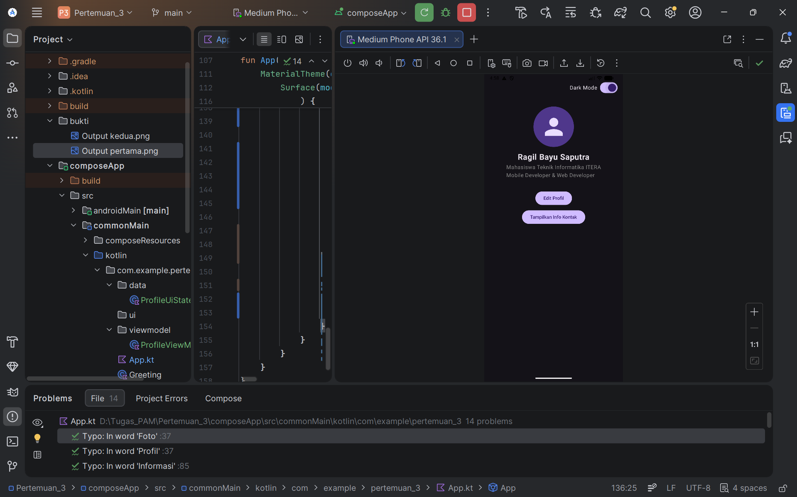
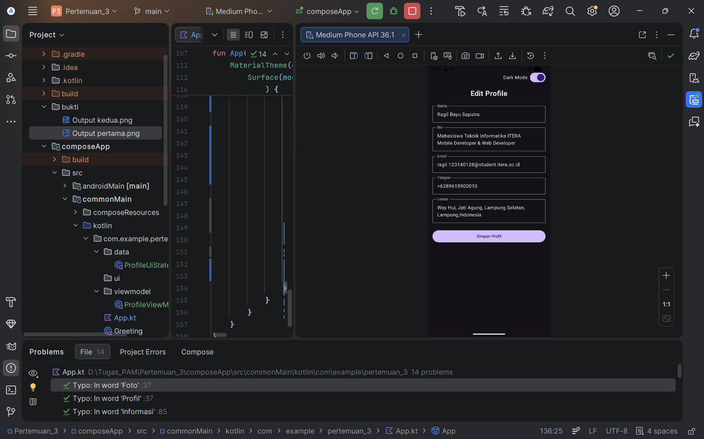

# Tugas Praktikum PAM - Pertemuan 4: State Management dan MVVM

**Identitas Mahasiswa:**
- **Nama:** Ragil Bayu Saputra
- **NIM:** 123140128

---

## Deskripsi Tugas
Aplikasi "My Profile App" ini merupakan pengembangan dari tugas sebelumnya dengan menerapkan arsitektur **MVVM (Model-View-ViewModel)** dan **State Management** menggunakan Compose Multiplatform. Aplikasi ini telah memenuhi seluruh kriteria penilaian Pertemuan 4:

1. **ViewModel Implementation (25%):** Menggunakan `ProfileViewModel` yang mengelola logika UI dan menyimpan *state* menggunakan `StateFlow`.
2. **UI State Pattern (20%):** Menerapkan *Single Source of Truth* dengan `data class ProfileUiState` untuk menyimpan data nama, bio, email, telepon, lokasi, dan status mode (edit/dark mode).
3. **State Hoisting (20%):** Membuat komponen `LabeledTextField` yang *stateless* untuk form edit, di mana *state* dan *event* ditarik ke atas (*hoisted*) ke *parent*.
4. **Edit Feature (20%):** Mengimplementasikan form edit fungsional yang memungkinkan pembaruan data profil secara *real-time* melalui ViewModel.
5. **Code Structure (15%):** Memisahkan kode ke dalam struktur folder yang rapi dan sesuai standar industri: `data/`, `viewmodel/`, dan `ui/`.
6. **🌟 BONUS (+10%):** Mengimplementasikan fitur **Dark Mode Toggle** (Switch) dengan *state* yang disimpan dan dikelola di ViewModel, memberikan transisi tema yang *smooth*.

*(Fitur dari Pertemuan 3 seperti penggunaan Layout, Reusable Composables, UI Components, Modifiers, dan AnimatedVisibility tetap dipertahankan dengan baik).*

---

## Bukti Screenshot Aplikasi

### 1. Tampilan Awal (Mode View & Dark Mode Aktif)

### 2. Tampilan Info Kontak Ditampilkan

### 3. Tampilan Form Edit Profile
