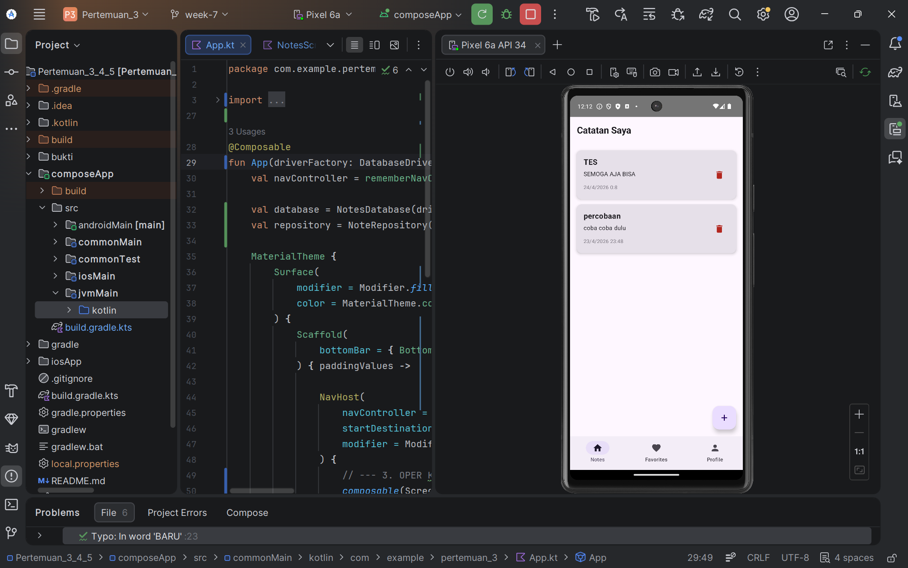
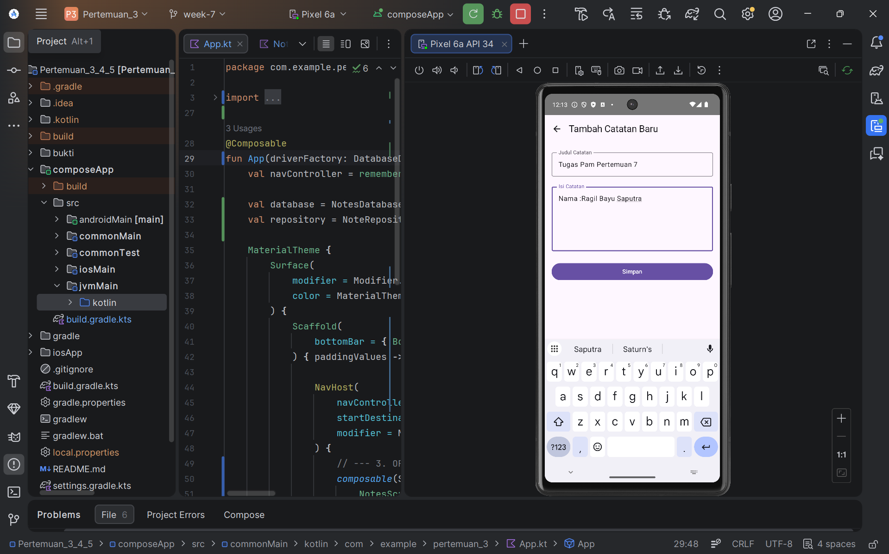
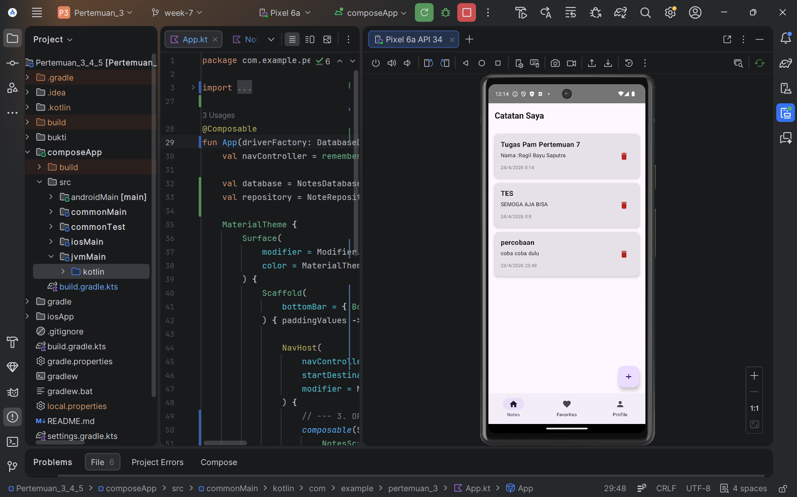
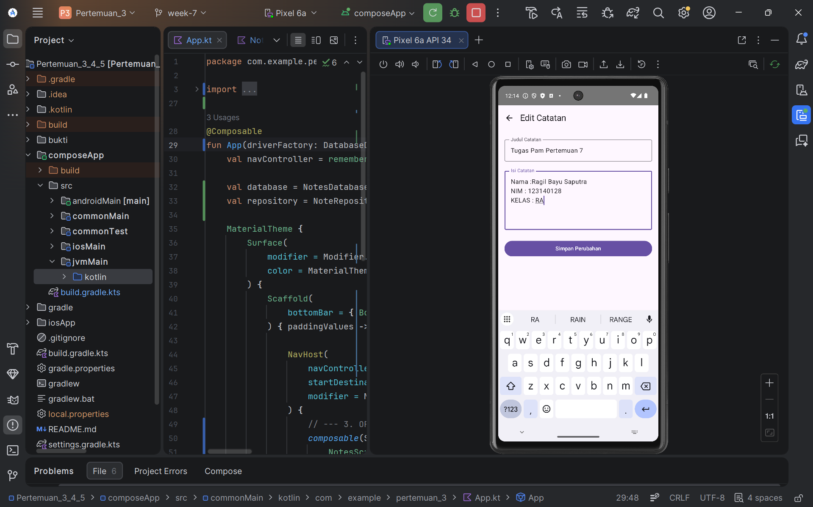
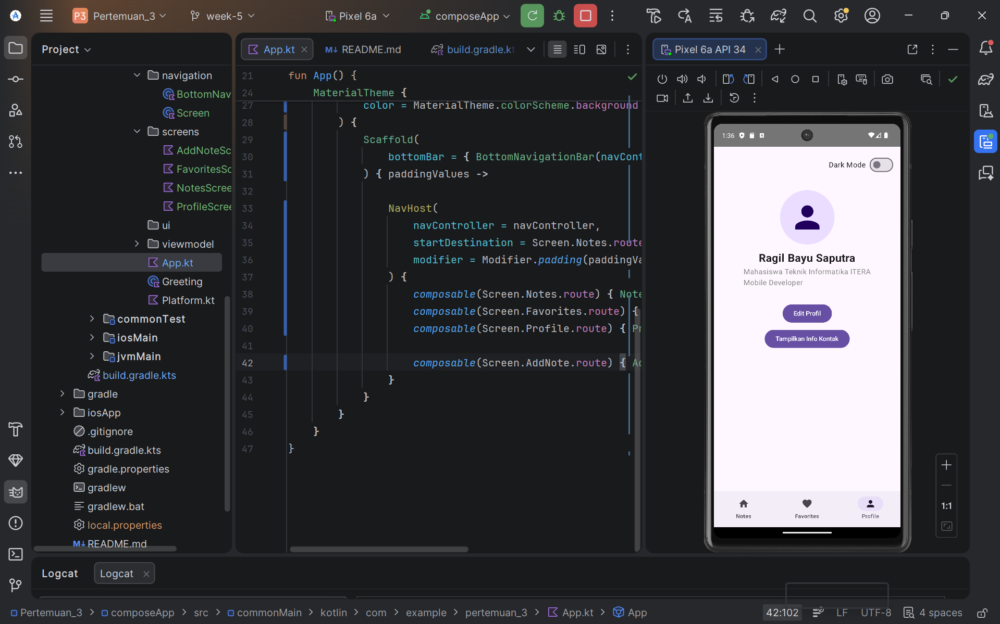

# Proyek Pengembangan Aplikasi Mobile - Pertemuan 3, 4, 5, & 7

Repositori ini berisi progres tugas mata kuliah Pemrograman Aplikasi Mobile (PAM). Untuk efisiensi struktur proyek, seluruh materi dan implementasi dari **Pertemuan 3, 4, 5, dan 7** dikonsolidasikan dan dikembangkan di dalam satu folder utama, yaitu folder `pertemuan_3`.

## 📂 Struktur Proyek & Cakupan Materi

Meskipun berada di dalam folder `pertemuan_3`, proyek ini mencakup integrasi materi dari beberapa pertemuan sekaligus:

* **Pertemuan 3:** Inisialisasi proyek Kotlin Multiplatform (KMP) dan dasar-dasar UI dengan Jetpack Compose.
* **Pertemuan 4:** Pengembangan komponen UI yang lebih kompleks, termasuk implementasi Profile Screen, Toggle Dark Mode, dan State Management dasar.
* **Pertemuan 5:** Implementasi sistem navigasi antar layar (Routing) menggunakan Compose Navigation, pembuatan Bottom Navigation Bar, dan integrasi antar halaman.
* **Pertemuan 7:** Inisialisasi Database lokal menggunakan **SQLDelight** untuk mengimplementasikan logika CRUD (Create, Read, Update, Delete) secara penuh, serta integrasi sistem waktu lokal menggunakan **Kotlinx Datetime** dengan arsitektur `expect`/`actual` untuk multiplatform.

*(Catatan: Tugas Pertemuan 6 merupakan proyek terpisah mengenai News API dan tidak digabungkan dalam repositori ini).*

## 🚀 Fitur Utama Saat Ini

* **Sistem CRUD Catatan (Full):** Kemampuan lengkap untuk **T**ambah, **B**aca, **E**dit, dan **H**apus catatan secara permanen di database lokal.
* **Sinkronisasi Data Real-Time:** Menggunakan `Flow` dari SQLDelight untuk memastikan data di layar UI selalu ter-*refresh* secara otomatis saat ada perubahan di database.
* **Format Waktu Dinamis:** Menyimpan dan menampilkan waktu pembuatan/perubahan catatan menggunakan format tanggal dan jam lokal perangkat yang diambil langsung dari sistem OS.
* **Navigasi Terpadu:** Menggunakan `NavHost` untuk mengelola perpindahan antar layar secara *seamless* beserta *Bottom Navigation Bar* sebagai menu akses cepat.
* **Profile Management:** Tampilan profil mahasiswa Teknik Informatika yang interaktif dengan fitur Dark Mode.

## 🛠️ Teknologi yang Digunakan

* **Kotlin Multiplatform (KMP)**
* **Jetpack Compose & Material Design 3**
* **Compose Navigation**
* **SQLDelight (Local Database)**
* **Kotlinx Datetime**

## 📸 Dokumentasi (Screenshots)

Berikut adalah dokumentasi visual dari fitur-fitur aplikasi yang telah diimplementasikan:

| Halaman Notes (Daftar Catatan) |         Formulir Tambah Catatan         |     Hasil Setelah Menambah Catatan      |
|:------------------------------:|:---------------------------------------:|:---------------------------------------:|
|  |  |  |

|           Formulir Edit Catatan           |       Hasil Setelah Mengedit Catatan        |
|:-----------------------------------------:|:-------------------------------------------:|
|  |  |

| Halaman Favorites | Halaman Profile |
| :---: | :---: |
|  |  |

---
*Dibuat oleh Ragil Bayu Saputra - Mahasiswa Teknik Informatika.*