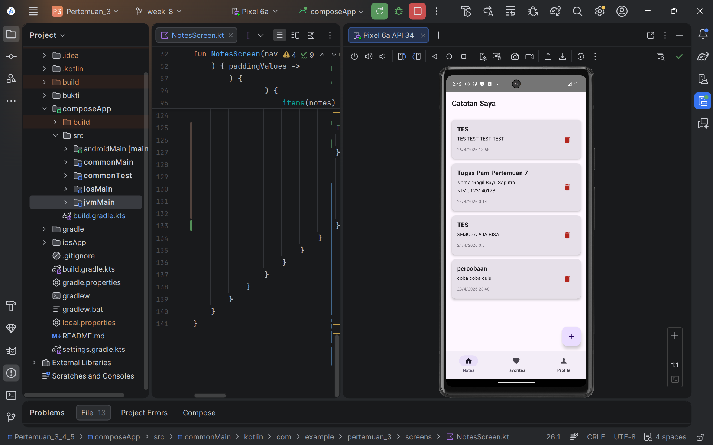
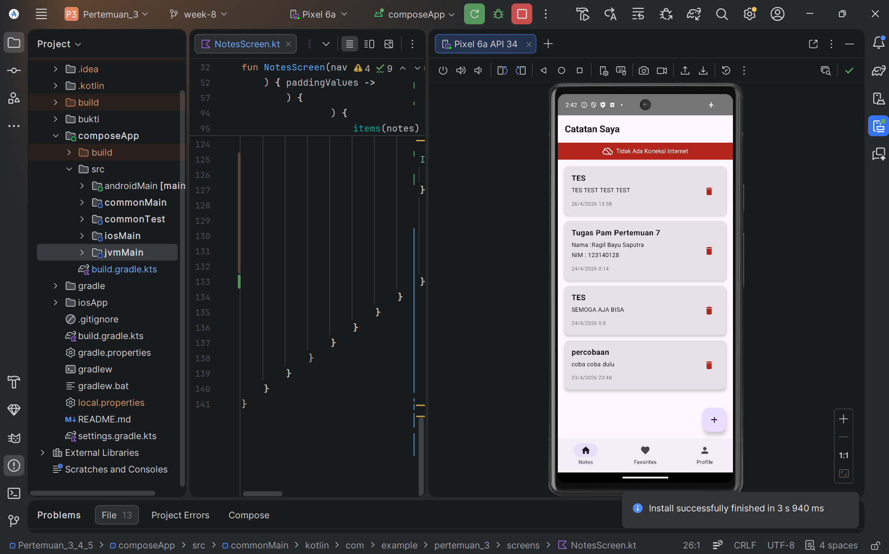
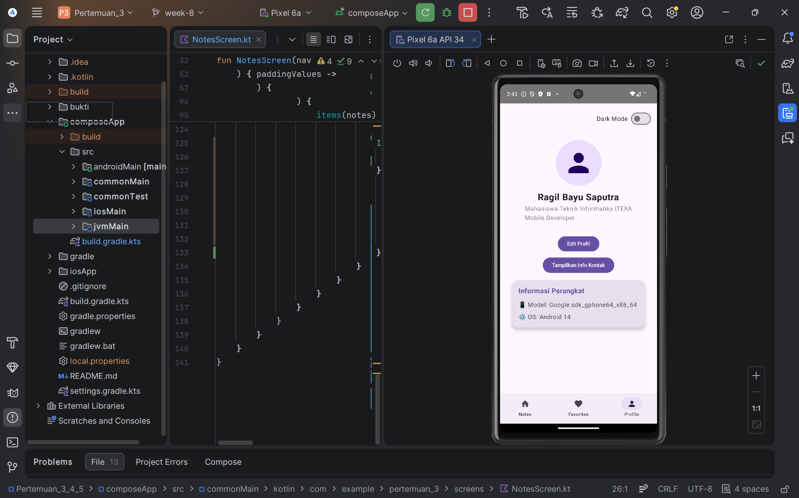

# Proyek Pengembangan Aplikasi Mobile - Pertemuan 3, 4, 5, 7, & 8

Repositori ini berisi progres tugas mata kuliah Pengembangan Aplikasi Mobile (PAM). Untuk efisiensi struktur proyek, seluruh materi dan implementasi dari **Pertemuan 3 hingga 8** dikonsolidasikan dan dikembangkan di dalam satu folder utama, yaitu folder `pertemuan_3`.

## 📂 Struktur Proyek & Cakupan Materi

Meskipun berada di dalam folder `pertemuan_3`, proyek ini mencakup integrasi materi dari beberapa pertemuan sekaligus:

* **Pertemuan 3:** Inisialisasi proyek Kotlin Multiplatform (KMP) dan dasar-dasar UI dengan Jetpack Compose.
* **Pertemuan 4:** Pengembangan komponen UI yang lebih kompleks, termasuk implementasi Profile Screen, Toggle Dark Mode, dan State Management dasar.
* **Pertemuan 5:** Implementasi sistem navigasi antar layar (Routing) menggunakan Compose Navigation, pembuatan Bottom Navigation Bar, dan integrasi antar halaman.
* **Pertemuan 7:** Inisialisasi Database lokal menggunakan **SQLDelight** untuk mengimplementasikan logika CRUD secara penuh, serta integrasi sistem waktu lokal dengan **Kotlinx Datetime**.
* **Pertemuan 8 (Terbaru):** Refactor arsitektur menggunakan **Dependency Injection (Koin)**, serta pemanfaatan pola `expect`/`actual` untuk mengakses fitur native platform (**Device Info** dan **Network Monitor**).

*(Catatan: Tugas Pertemuan 6 merupakan proyek terpisah mengenai News API dan tidak digabungkan dalam repositori ini).*

## 🚀 Fitur Utama Saat Ini

* **Sistem CRUD Catatan (Full):** Kemampuan lengkap untuk menambah, membaca, mengedit, dan menghapus catatan di database lokal secara sinkron.
* **Dependency Injection Terpusat:** Pengelolaan *instance* (seperti Database, Repository, dan Sensor) secara efisien dan otomatis menggunakan **Koin**.
* **Pemantau Jaringan (Network Monitor):** Deteksi status koneksi internet secara *real-time* (memunculkan indikator peringatan otomatis saat perangkat *offline*).
* **Deteksi Perangkat (Device Info):** Membaca dan menampilkan spesifikasi *hardware* (Model HP) dan versi sistem operasi native langsung ke layar UI profil.
* **Navigasi Terpadu:** Menggunakan `NavHost` untuk mengelola perpindahan antar layar beserta *Bottom Navigation Bar*.
* **Profile Management:** Tampilan profil interaktif dengan informasi kontak, fitur Edit Mode, dan Toggle Dark Mode.

## 🛠️ Teknologi yang Digunakan

* **Kotlin Multiplatform (KMP)**
* **Jetpack Compose & Material Design 3**
* **Compose Navigation**
* **SQLDelight (Local Database)**
* **Koin (Dependency Injection)**
* **Kotlinx Coroutines & Flow**

## 📸 Dokumentasi (Screenshots)

Berikut adalah dokumentasi visual dari fitur-fitur aplikasi yang telah diimplementasikan:

|     Catatan Normal (Online & Koin DI)     |      Catatan Offline (Network Monitor)      |
|:-----------------------------------------:|:-------------------------------------------:|
|  |  |

|      Halaman Profile (Device Info)      | Halaman Favorites |
|:---------------------------------------:|:---:|
|  |  |

---
*Dibuat oleh Ragil Bayu Saputra - Mahasiswa Teknik Informatika.*