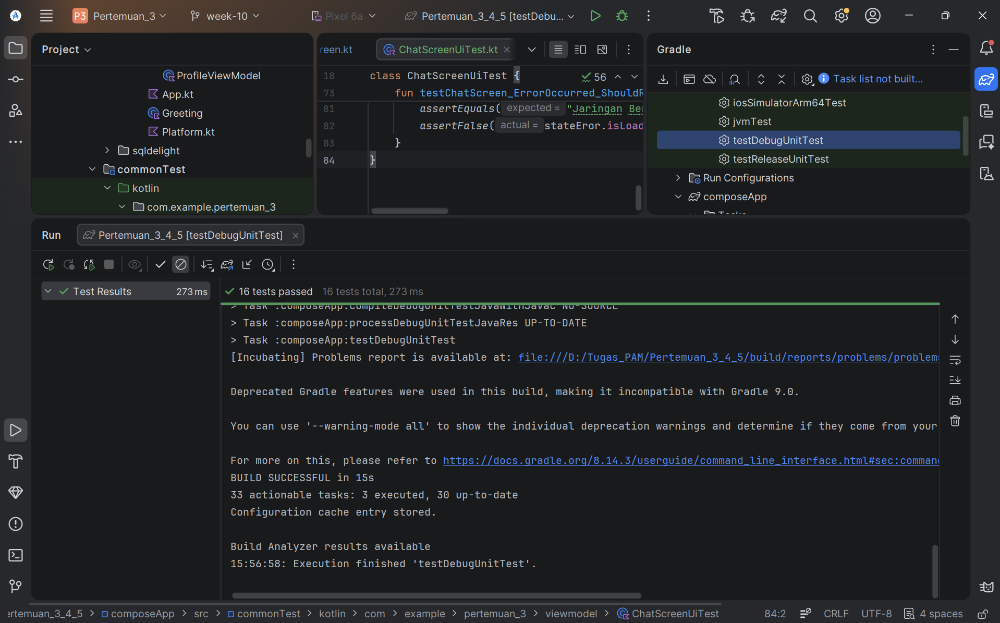

# Proyek Pengembangan Aplikasi Mobile - Pertemuan 3 hingga 10

Repositori ini berisi progres tugas mata kuliah Pengembangan Aplikasi Mobile (PAM). Untuk efisiensi struktur proyek, seluruh materi dan implementasi dari **Pertemuan 3 hingga 10** dikonsolidasikan dan dikembangkan di dalam satu folder utama, yaitu folder `pertemuan_3`.

## 📂 Struktur Proyek & Cakupan Materi

Meskipun berada di dalam folder `pertemuan_3`, proyek ini mencakup integrasi materi dari beberapa pertemuan sekaligus:

* **Pertemuan 3:** Inisialisasi proyek Kotlin Multiplatform (KMP) dan dasar-dasar UI dengan Jetpack Compose.
* **Pertemuan 4:** Pengembangan komponen UI yang lebih kompleks, termasuk implementasi Profile Screen, Toggle Dark Mode, dan State Management dasar.
* **Pertemuan 5:** Implementasi sistem navigasi antar layar (Routing) menggunakan Compose Navigation, pembuatan Bottom Navigation Bar, dan integrasi antar halaman.
* **Pertemuan 7:** Inisialisasi Database lokal menggunakan **SQLDelight** untuk mengimplementasikan logika CRUD secara penuh, serta integrasi sistem waktu lokal dengan **Kotlinx Datetime**.
* **Pertemuan 8:** Refactor arsitektur menggunakan **Dependency Injection (Koin)**, serta pemanfaatan pola `expect`/`actual` untuk mengakses fitur native platform (**Device Info** dan **Network Monitor**).
* **Pertemuan 9:** Integrasi asisten pintar berbasis kecerdasan buatan memanfaatkan **Google Gemini AI API** (Generative Language API) menggunakan model generasi terbaru melalui **Ktor Client** dan **Kotlinx Serialization**.
* **Pertemuan 10:** Implementasi penjaminan kualitas kode melalui **Unit Testing** memanfaatkan framework `kotlin.test`, pembuatan komponen data tiruan (*Fake Repository*), pengujian asinkronus aliran data State menggunakan **Turbine**, serta *State-Driven UI Testing*.

*(Catatan: Tugas Pertemuan 6 merupakan proyek terpisah mengenai News API dan tidak digabungkan dalam repositori ini).*

## 🚀 Fitur Utama Saat Ini

* **Asisten Pintar Gemini AI (Multi-turn Chat):** Integrasi fitur chat interaktif secara *real-time* dengan Google Gemini menggunakan model generasi ke-3 untuk membantu produktivitas pengguna langsung di dalam aplikasi.
* **Sistem CRUD Catatan (Full):** Kemampuan lengkap untuk menambah, membaca, mengedit, dan menghapus catatan di database lokal secara sinkron.
* **Dependency Injection Terpusat:** Pengelolaan *instance* (seperti Database, Repository, dan Service AI) secara efisien dan otomatis menggunakan **Koin**.
* **Pemantau Jaringan (Network Monitor):** Deteksi status koneksi internet secara *real-time* (memunculkan indikator peringatan otomatis saat perangkat *offline*).
* **Deteksi Perangkat (Device Info):** Membaca dan menampilkan spesifikasi *hardware* (Model HP) dan versi sistem operasi native langsung ke layar UI profil.
* **Navigasi Terpadu:** Menggunakan `NavHost` untuk mengelola perpindahan antar layar beserta *Bottom Navigation Bar*.
* **Profile Management:** Tampilan profil interaktif dengan informasi kontak, fitur Edit Mode, dan Toggle Dark Mode.

## 🧪 Pengujian & Kualitas Kode (Tugas Praktikum Pertemuan 10)

Untuk menjamin keandalan fitur dan arsitektur aplikasi sesuai dengan rubrik penilaian Pertemuan 10, proyek ini telah dilengkapi dengan **16 Test Cases** menyeluruh yang mencakup pengujian lapisan data, logika bisnis, hingga state antarmuka. Seluruh pengujian dijalankan dan divalidasi menggunakan Gradle Task `:composeApp:testDebugUnitTest` dengan status **BUILD SUCCESSFUL (100% Passed)**.

### 📊 Cakupan Komponen Pengujian:
1. **Unit Test Repository (SQLDelight CRUD - 6 Tests):** Menguji validitas operasi lokal database untuk memastikan fungsi insert, read, update, dan delete catatan berjalan secara sinkron dan bebas konflik data (Memenuhi target minimal 5 *test cases*).
2. **Unit Test ViewModel via Fake/Mock (4 Tests):** Menguji penanganan logika bisnis pada `ChatViewModel` saat memproses pesan valid, penolakan pesan kosong, dan skenario kegagalan sistem (Memenuhi target minimal 4 *test cases*).
3. **State Flow Testing via Turbine (2 Tests):** Memantau emisi data secara asinkron pada komponen `StateFlow` untuk memastikan transisi *loading state* dan fungsi pembersihan riwayat chat tereksekusi dengan tepat (Memenuhi target minimal 2 *test cases*).
4. **State-Driven UI Component Testing (4 Tests):** Memvalidasi rendering komponen antarmuka layar chat secara logis, memastikan komponen `LazyColumn` (Daftar Chat), `TypingIndicator`, dan *Error Text* muncul sesuai dengan perubahan kondisi data kontrak UI (Memenuhi target minimal 3 *test cases*).

---

## 📸 Dokumentasi (Screenshots)

Berikut adalah dokumentasi visual dari fitur-fitur aplikasi serta hasil pengujian otomatis yang telah diimplementasikan:

### 🛠️ Bukti Hasil Pengujian Otomatis Pertemuan 10 (Green Test)
| Hasil Eksekusi Rangkaian 16 Test Cases (BUILD SUCCESSFUL) |
|:---:|
|  |

### 📱 Tampilan Antarmuka Aplikasi
| Catatan Normal (Online & Koin DI) | Catatan Offline (Network Monitor) |
|:---:|:---:|
|  |  |

| Halaman Profile (Device Info) | Fitur Integrasi Gemini AI |
|:---:|:---:|
|  |  |

| Halaman Favorites |
|:---:|
|  |

## 🛠️ Teknologi yang Digunakan

* **Kotlin Multiplatform (KMP)**
* **Jetpack Compose & Material Design 3**
* **Compose Navigation**
* **SQLDelight (Local Database)**
* **Ktor Client (Network Library untuk API AI)**
* **Kotlinx Serialization (JSON Parsing Engine)**
* **Koin (Dependency Injection)**
* **Kotlinx Coroutines & Flow**
* **Turbine & Kotlinx Coroutines Test (Testing Framework)**

---
*Dibuat oleh Ragil Bayu Saputra - Mahasiswa Teknik Informatika.*