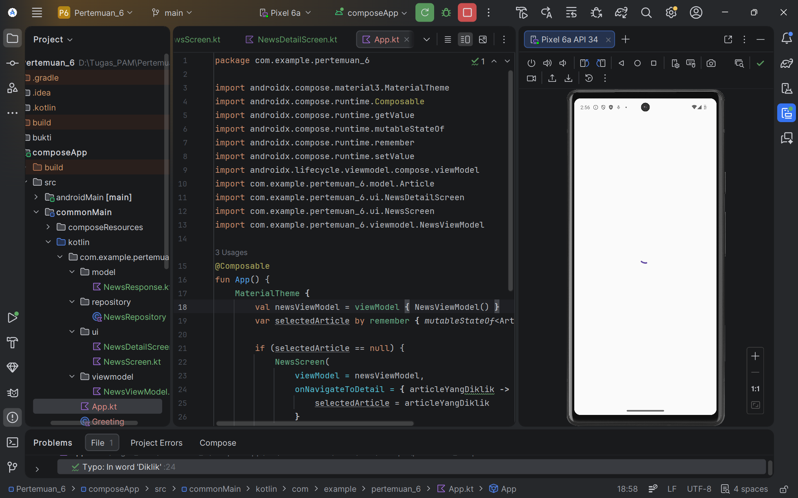
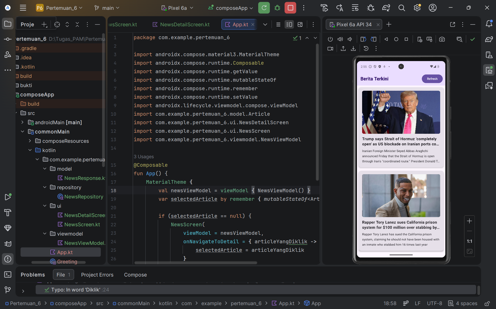
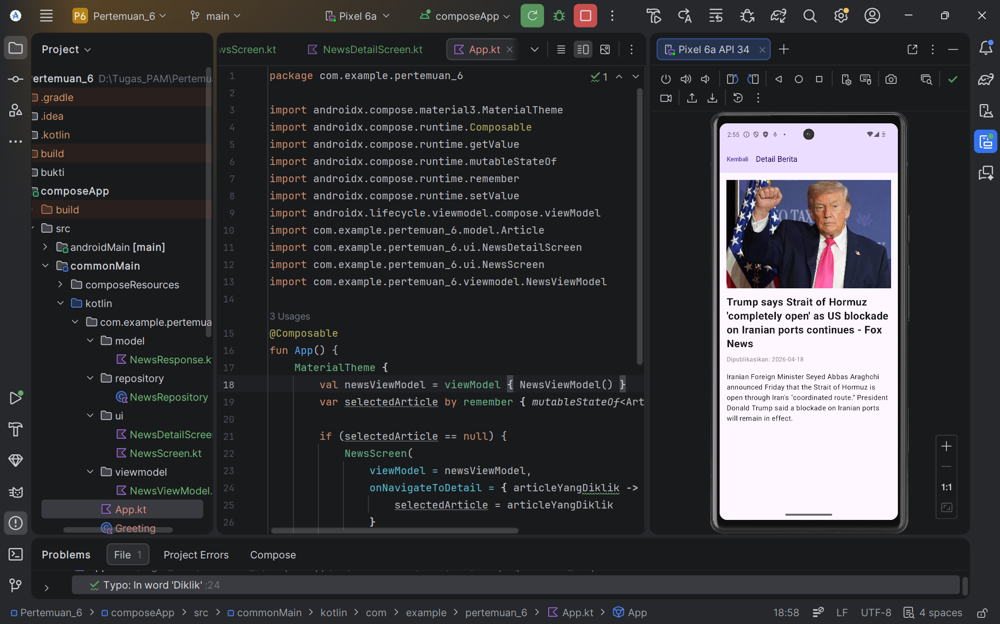

# 📰 Tugas Praktikum PAM - Pertemuan 6 (News App KMP)

**Nama:** Ragil Bayu Saputra
**NIM:** 123140128
**Mata Kuliah:** Pengembangan Aplikasi Mobile (PAM)

## 📝 Deskripsi Proyek
Aplikasi pembaca berita (*News Reader*) berbasis **Kotlin Multiplatform (KMP)**. Aplikasi ini secara dinamis mengambil dan menampilkan berita utama (*Top Headlines*) menggunakan REST API.

## 🌐 API yang Digunakan
Proyek ini menggunakan **NewsAPI** (`newsapi.org`) sebagai sumber data.
* **Endpoint:** `https://newsapi.org/v2/top-headlines?country=us`
* **Format Data:** JSON
* **Autentikasi:** Menggunakan *API Key* pribadi yang disisipkan pada parameter URL untuk mendapatkan akses gratis (*Developer Plan*).

## ✨ Komponen & Fitur yang Diimplementasikan
* **Ktor Client & Content Negotiation:** Digunakan untuk melakukan *HTTP GET request* ke server NewsAPI.
* **Kotlinx Serialization:** Berfungsi menerjemahkan respons JSON yang kompleks dari server menjadi Kotlin *Data Class* (`NewsResponse` dan `Article`).
* **Kamel Image Library:** Mengunduh dan menampilkan gambar artikel berita secara asinkron (*lazy loading*) agar performa UI tetap responsif.
* **State Hoisting Navigation:** Logika perpindahan layar yang mulus dari `NewsScreen` (Daftar Berita) ke `NewsDetailScreen` (Detail Berita).
* **UI State Management:** Menerapkan `StateFlow` pada `ViewModel` untuk menangani status *Loading* (indikator berputar), *Success* (menampilkan daftar), dan *Error* (penanganan jika koneksi terputus).
* **Pull-to-Refresh:** Mengambil ulang data berita terbaru melalui interaksi gestur tarik-ke-bawah (menggunakan *Material 3 PullToRefreshContainer* / Tombol Aksi).

## 📸 Bukti Pengerjaan (Screenshots)

Berikut adalah hasil *running* aplikasi pada perangkat Android:

|              Tampilan Loading              |         Tampilan Awal (Daftar Berita)          |              Tampilan Detail Berita              |
|:------------------------------------------:|:----------------------------------------------:|:------------------------------------------------:|
|  |  |  |

---
*Dibuat menggunakan Android Studio & Jetpack Compose Multiplatform.*